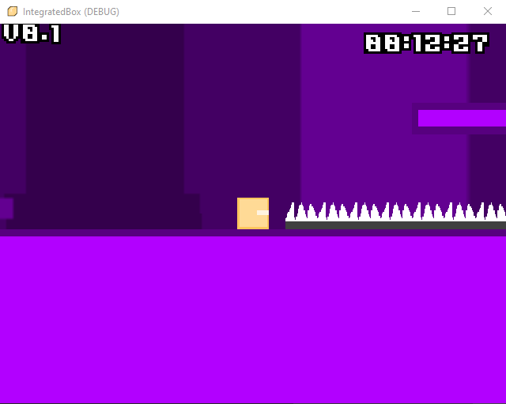
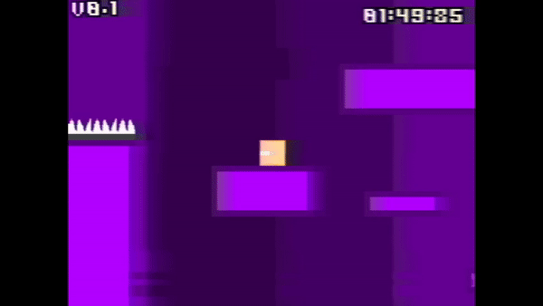

# Integrated Box
A godot game about a celeste like momentum based kinematic box. 

Its a physics-dashing-momentum based platfomer basically.

**THIS IS STILL A WORK IN PROGRESS! DON'T EXPECT THINGS TO BE _FULLY_ DONE!**

_You're a box. Your only objective is to get to the haha funny black box and get through series of levels._

_There's nothing much you can do about it. Hey, at least you can move._

___This game sucks___

- IGN 0/10

___what___

- the creator -1/10

___YOOOO___

- gedehari 7/10

# How to play dis?
Go to [releases](https://github.com/haya3218/IntegratedBox/releases/) you fucking idiot.

If you wanna play the `main` branch of the game, then you need to have Godot, scan and launch the project from there.
